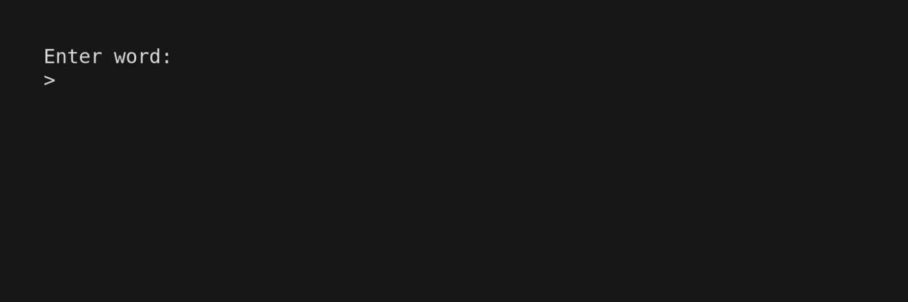

# Go-cabulary

A simple Terminal dictionary app built in Go using the [Bubble Tea framework](https://github.com/charmbracelet/bubbletea)
and [Free Dictionary API](https://dictionaryapi.dev/).

**Demo** (created using [VHS](https://github.com/charmbracelet/VHS))

