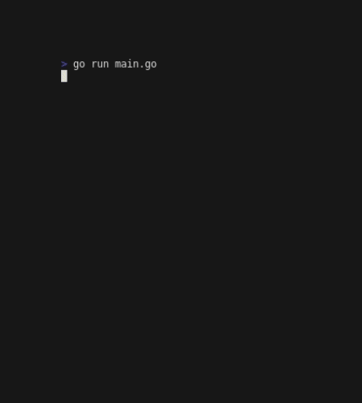

# Go-nnect4

A Connect 4 Terminal game written in Go using the [Bubble Tea framework](https://github.com/charmbracelet/bubbletea).

Logic is copied from [the Python Connect 4 game I wrote previously](../connect_4/)

**Demo**

## Roadmap

- [x] Display board and cursor
- [x] Check win
- [ ] Prettify output with Lipgloss
