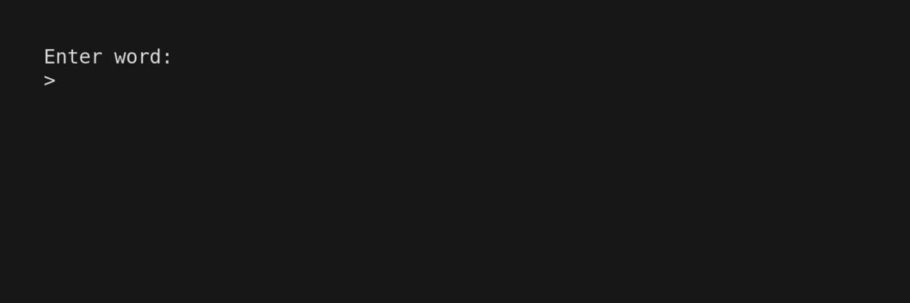

# Go-cabulary

A simple Terminal dictionary app built in Go using the [Bubble Tea framework](https://github.com/charmbracelet/bubbletea)
and [Free Dictionary API](https://dictionaryapi.dev/).

Based on the [go-tea-weather Bubble Tea tutorial](https://github.com/nicolasparada/go-tea-weather).

**Demo** (via [VHS](https://github.com/charmbracelet/VHS))

